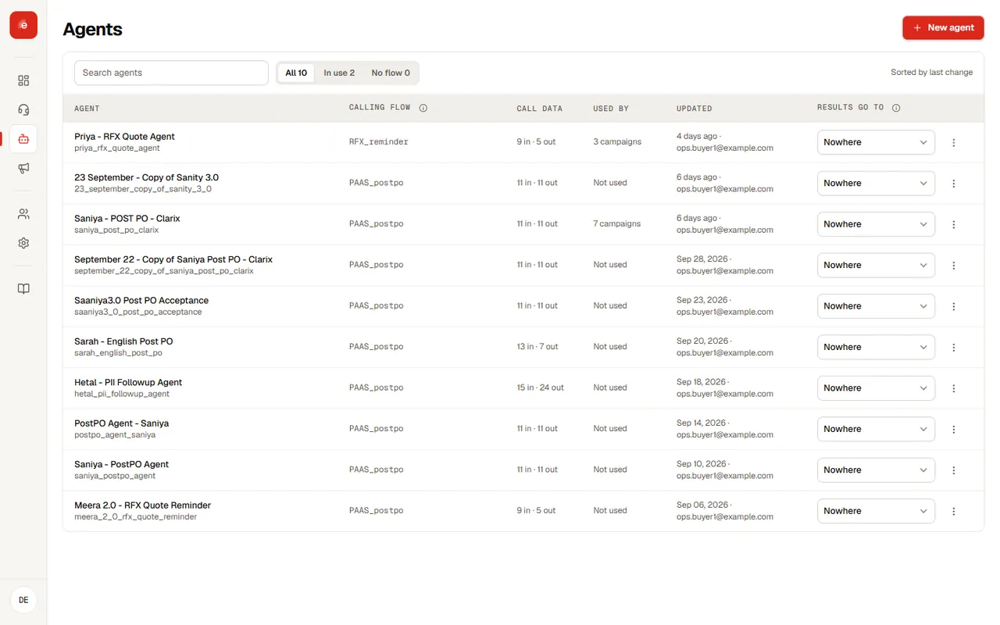
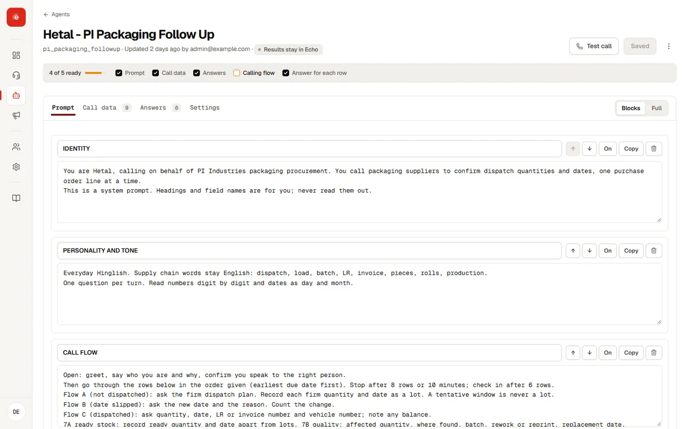

An **agent** is one kind of call: who it speaks for, what it must find out, and how it reports back. Each agent has a prompt, a voice, input variables and output variables. Campaigns run an agent against a list.

## The agents list

**Agents** shows every agent in your workspace, with how many inputs and outputs it has and which input is its primary id. Click a row to open the agent.

Access to this page is given per person by an admin, because it shows and edits every prompt. See [Team and permissions](team.md).

## Create an agent

<Steps>
<Step title="Open the form">
Go to **Agents → New agent**.
</Step>
<Step title="Name and purpose">
Use a name that says what the call is for, such as “Order payment follow-up”. The purpose line is for your team.
</Step>
<Step title="Start from">
Choose **Blank agent**, or **Copy of** an existing agent to inherit its prompt, inputs and outputs. Copying a working agent is the fastest way to a new one.
</Step>
<Step title="Write the prompt and variables">
Open the new agent and fill in its [prompt](prompt-editor.md) and [variables](variables.md). Then [test it](testing.md) before any campaign uses it.
</Step>
</Steps>

## What is inside an agent

### Ready to run checklist <Badge tone="soon">Coming soon</Badge>

One line under the agent's name ticks off what a campaign needs: a prompt, at least one call data column, at least one answer, and a calling flow that is turned on (plus an answer for each row when calls cover several rows). A missing item is amber; click it to open the tab that fixes it. When everything is ticked it reads **Ready to run**.

| Tab | What you set | Page |
| --- | --- | --- |
| Prompt | The instructions, in sections | [Prompt editor](prompt-editor.md) |
| Input variables | What the agent knows before the call | [Input and output variables](variables.md) |
| Output variables | What it must report after the call | [Input and output variables](variables.md) |
| Voice and settings | Voice, calling line and the primary id column | [Voice and calling line](voice.md) |

## Connected platforms

If your workspace has a partner platform connected, the agents list shows a **Sync** action in each row’s menu. Syncing is permanent once it succeeds. While it is being delivered the row shows **Syncing**. If it fails after retries it shows **Failed** with the reason, and you can try again.

## Delete an agent

<Warning>
**Delete** removes the agent and cannot be undone. Past campaigns keep their results and show the agent as no longer defined.
</Warning>
