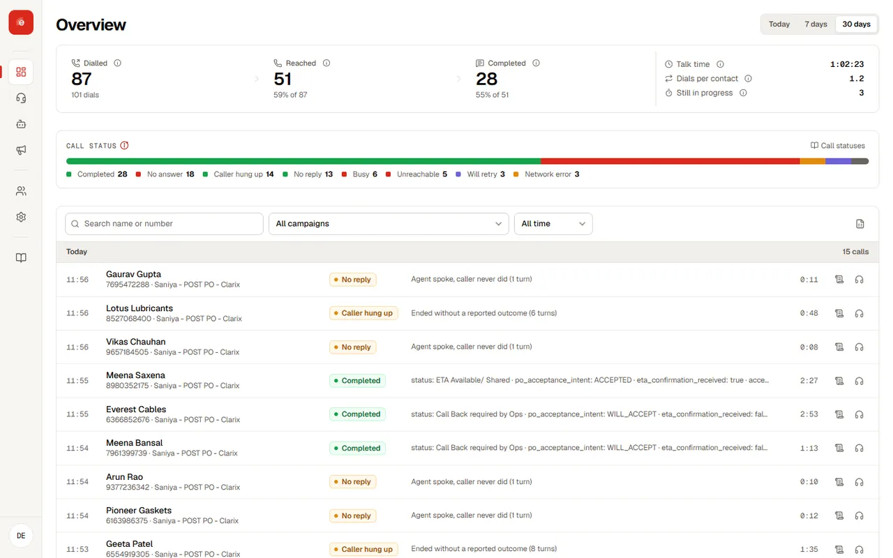

Echo turns a call your team makes every day into an agent that makes it for you, and writes back what each call found out. This guide covers everything in the Echo console.

<Tip title="Try it without an account">
The [clickable demo](https://theruka7.github.io/echo_prototype/) runs the whole console in your browser on sample data. Sign in with any email and password.
</Tip>

## From idea to results

<Steps>
<Step title="Create an agent">
Write what it should say and what it must find out. [Create an agent →](agents.md)
</Step>
<Step title="Test it">
Talk to it from your browser or on a real phone, and watch the values it captures. [Call console →](testing.md)
</Step>
<Step title="Run a campaign">
Upload a sheet and confirm the columns. Echo calls every row. [Create and run a campaign →](campaigns.md)
</Step>
<Step title="Use the outcomes">
Read every response, recording and transcript, and download them for your systems. [Results and exports →](results.md)
</Step>
</Steps>

## Browse by feature

<CardGroup cols="3">
<Card title="Core concepts" href="concepts" eyebrow="Get started">Agents, variables, campaigns, calls and outcomes.</Card>
<Card title="Prompt editor" href="prompt-editor" eyebrow="Agents">Sections, tokens and automatic sections.</Card>
<Card title="Input and output variables" href="variables" eyebrow="Agents">What the agent knows, and what it reports.</Card>
<Card title="Voice and calling line" href="voice" eyebrow="Agents">Voice, language and the line calls go out on.</Card>
<Card title="Call console" href="testing" eyebrow="Test">Live test calls with transcript and captured values.</Card>
<Card title="Upload and map contacts" href="contacts" eyebrow="Campaigns">Templates, uploads and column mapping.</Card>
<Card title="Overview and call log" href="monitoring" eyebrow="Monitor">Every call, with filters and downloads.</Card>
<Card title="Call statuses" href="statuses" eyebrow="Monitor">The exact rule behind every call and campaign status.</Card>
<Card title="Call analysis" href="analysis" eyebrow="Monitor">Summary, priority and action items per call.</Card>
<Card title="Team and permissions" href="team" eyebrow="Workspace">Roles, groups and agent access.</Card>
</CardGroup>

## For developers

Developer tools are <Badge tone="soon">Coming soon</Badge>: the **Reverb** command line, the **Relay** MCP server for AI tools, agent skills, and a public REST API with webhooks. [Preview the developer docs →](../developers/index.md)

## Getting help

Your account team sets up your workspace, calling lines and first agent with you, and is your first contact for questions. Before a pilot, [talk to an expert](/#pilot) or use the [Cognilix contact page](https://www.cognilix.com/contact-us).
