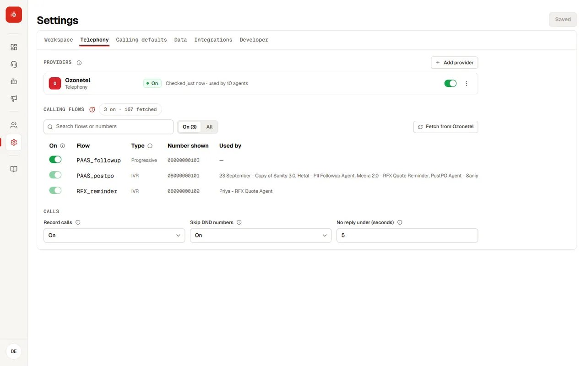
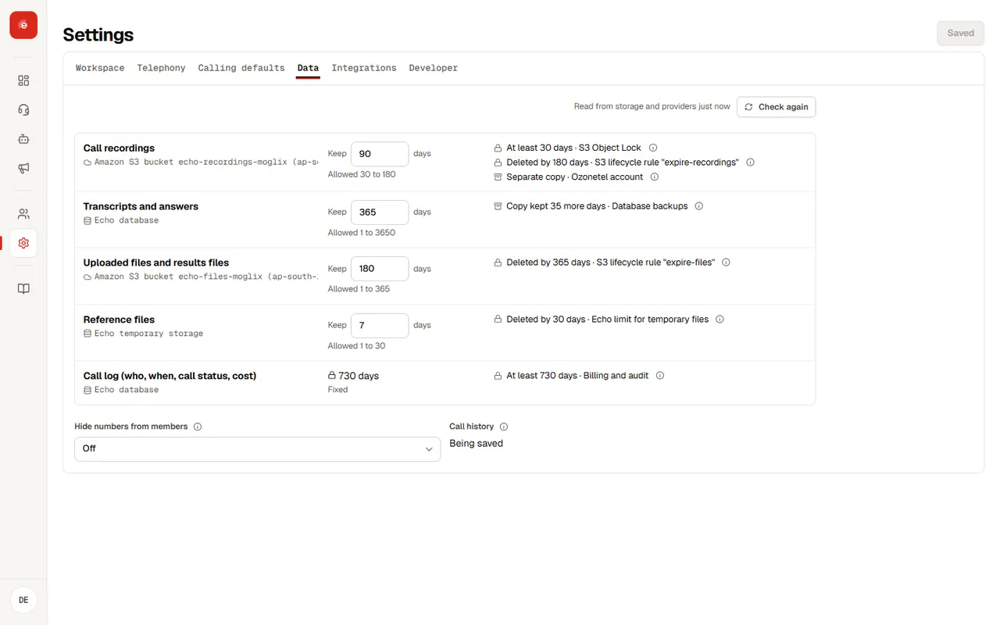
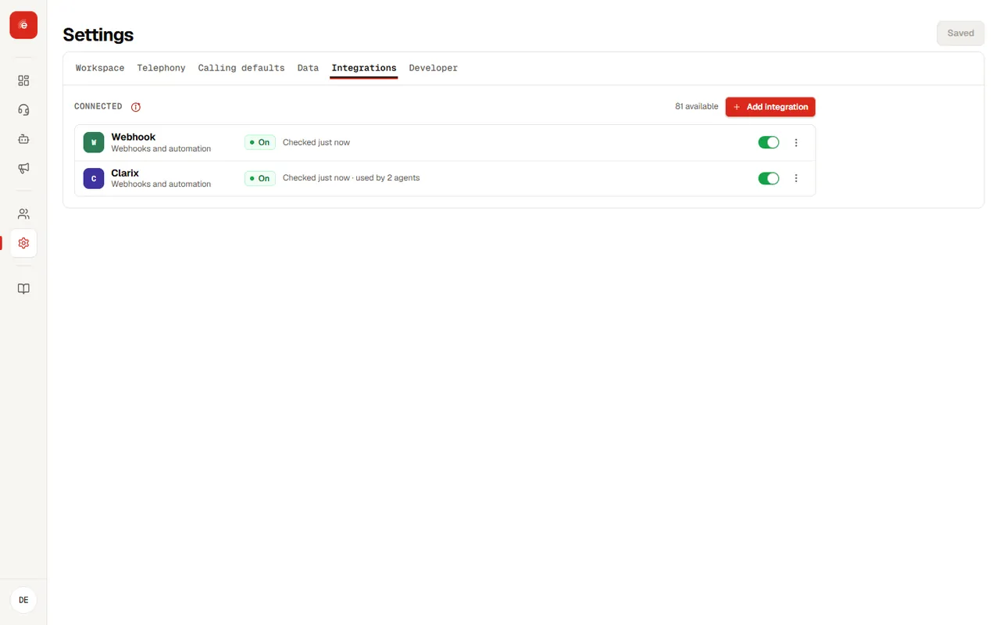
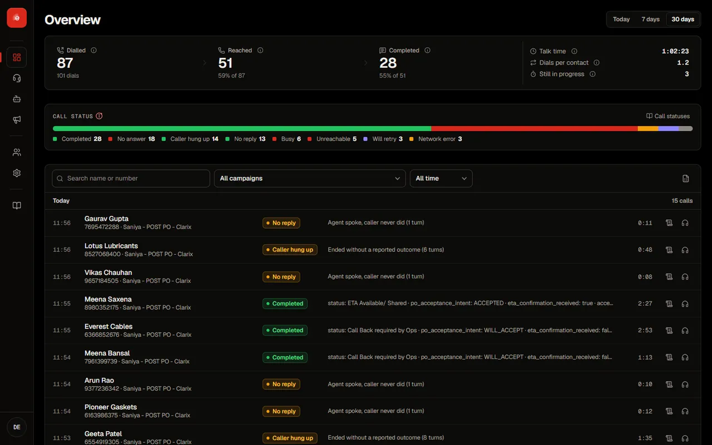

**Settings** is the page to check first when something looks wrong.

## Your account

| Field | What it shows |
| --- | --- |
| Signed in as | Your email and your access level, such as platform admin or agent admin. |
| Organisation | The organisation you are working in. If you belong to more than one, switch here. |
| Version | The console version, useful when you report an issue. |

## Service status

Settings shows whether Echo and the services it depends on are reachable: the Echo backend, the calling provider, and storage for recordings and exports. Press **Refresh** to check again.

<Tip>
If calls stop going out, check service status first, then the agent’s [calling line](voice.md). Send your account team the console version and the time it started.
</Tip>

## Telephony and calling flows <Badge tone="soon">Coming soon</Badge>

Connect each telephony provider once. Echo fetches every calling flow (IVR or campaign) from it; turn on the flows your agents may use. An agent can only pick a flow that is turned on, and a flow an agent uses cannot be turned off until the agent moves.

## Calling defaults and status rules <Badge tone="soon">Coming soon</Badge>

Set calling hours, how many tries a call gets and the gap between them, and which call statuses are tried again. Every status explains what it means, how it is decided and what happens next. The full rules are on [Call statuses](statuses).

## Data <Badge tone="soon">Coming soon</Badge>

## Integrations <Badge tone="soon">Coming soon</Badge>

Add a destination for results (Clarix, a webhook and many more). Echo runs checks before saving it, shows when it was last checked, and asks before removing one.

## Light and dark <Badge tone="soon">Coming soon</Badge>

## Sessions

Sessions expire for safety. When yours does, Echo returns you to sign in.
