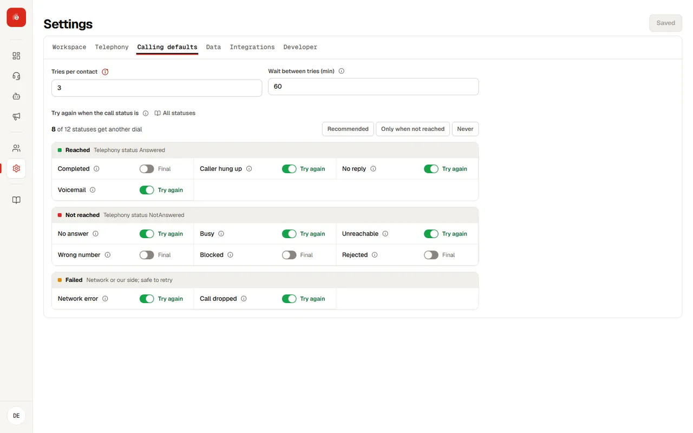

Echo is the source of truth for every call and campaign. Each dial gets the telephony provider's result and what Echo's own audio heard; one rule turns that into one call status. Connected platforms such as Clarix show exactly what Echo sends and never work a status out themselves.

## Call statuses

| Status | Group | What it means | Tried again by default |
| --- | --- | --- | --- |
| Completed | Reached | Picked up and the agent finished the conversation | No |
| Caller hung up | Reached | Picked up, the caller spoke, then hung up before the agent finished | Yes |
| No reply | Reached | Picked up, but the caller never spoke | Yes |
| Voicemail | Reached | A machine answered | Yes |
| No answer | Not reached | Rang and nobody picked up | Yes |
| Busy | Not reached | Line busy | Yes |
| Unreachable | Not reached | Switched off, out of coverage or no route | Yes |
| Invalid number | Not reached | The number does not exist or is badly formed | No |
| Blocked | Not reached | DND or an explicit block from the network | No |
| Rejected | Not reached | An explicit decline from the provider | No |
| Failed | Failed | The network or provider failed before it rang, or sent a value Echo does not know | Yes, except unknown values |
| Will retry | In progress | Not settled yet; the next dial is booked | |
| Retry exhausted | Final | Every allowed try was used without settling the call; the last try's result is kept | |
| Repeated number | Not dialled | The same phone appeared earlier in the file | No |
| Bad data | Not dialled | The row failed the upload checks | No |
| Cancelled | Not dialled | The campaign was stopped, or failed, before this call was placed | No |

## How a status is decided

Echo applies the first rule that matches, top to bottom.

| Signal | Status |
| --- | --- |
| Echo's own audio stream connected | Completed, Caller hung up, No reply or Voicemail, from what Echo heard |
| Provider says Answered, but the agent never joined | Failed (technical drop) |
| Customer status Busy | Busy |
| InvalidNumber or InvalidNumberFormat | Invalid number |
| SubscriberAbsent or NoRouteDestination | Unreachable |
| Congestion, exception or ISDDisabled | Failed |
| DND or an explicit block | Blocked |
| An explicit decline | Rejected |
| NoResponse, ring, NormalUnspecified, or not_answered with no other detail | No answer |
| Anything else | Failed, with the raw values logged; never guessed as No answer |

<Info title="Duration never decides on its own">
Talk time backs up what Echo heard; it never sets a status alone. A call where the caller never spoke is No reply. A very short call counts as No reply only when the agent also did not finish.
</Info>

## Tries

The workspace sets how many tries a call gets and the gap between them; an agent can change both. When the last try still has not settled the call, it becomes **Retry exhausted** and keeps what the last try was, for example "no answer, 3 tries". A call can also be tried again because of an answer, such as a supplier asking to be called back.

## Campaign statuses

| Status | When |
| --- | --- |
| Ready | Created, no call placed yet |
| Running | At least one call is waiting, calling, on a call or booked for another try |
| Paused | Held; calls not placed yet wait until it is resumed |
| Completed | Every call has a final status, even if some were not reached or failed |
| Partially completed | The campaign ended (stopped) while some calls were never placed |
| Cancelled | Stopped before any call was placed |
| Failed | The campaign itself could not run, for example its calling flow is gone or the telephony provider is disconnected; individual call failures never fail a campaign |
