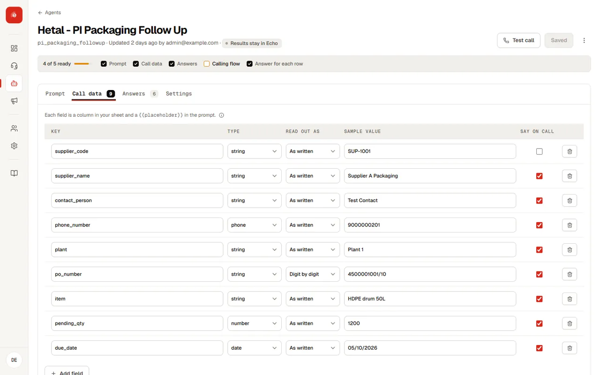
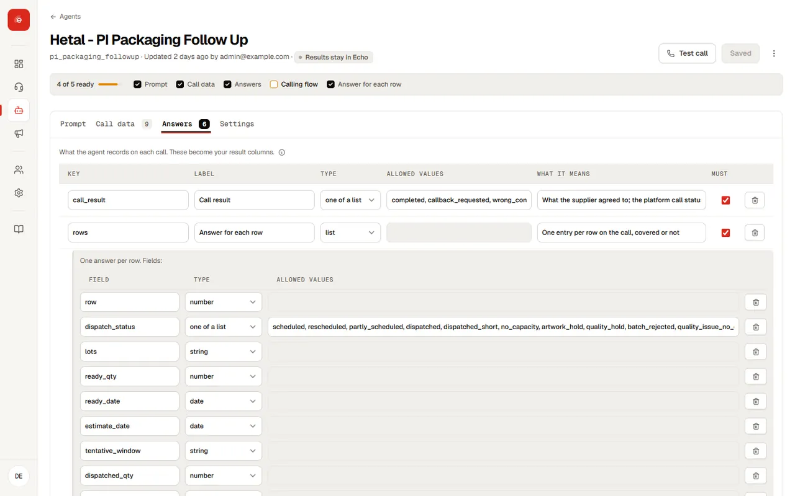

## Input variables

Each input is one column of your sheet and one token in the prompt.

| Field | What it does |
| --- | --- |
| Key | The token name, such as `order_id`. Used as `{{order_id}}` in the prompt and as the column name in the template. |
| Type | The kind of value, such as text or a number. |
| Transform | **Spell digits** makes the agent read a value digit by digit, right for order, PO and phone numbers. Never use it for amounts or counts. |
| Sample value | Used in test calls and previews, so you can try the agent without a sheet. |
| Share on call | On: the agent may say and discuss this value. Off: the value is internal (see below). |

<figure class="ui">
<i></i><i></i><i></i>Echo · Agents · Dispatch follow-up · Input variables

Key (the token)TypeTransformSample valueShare on call

supplier_namestringNoneMehta Packaging✓

po_numberstringSpell digits4471✓

open_qtynumberNone14✓

supplier_codestringNoneV-20931internal

phonephoneNone98765 43210✓

<b>Primary id column</b>po_number

KeyLabelTypeOptionsRequired

statusStatusenumCONFIRMED, PARTIAL, NEW_DATE, CALL_BACK✓

dispatch_dateDispatch datestring✓

qty_readyQuantity readynumber✓

next_stepNext stepstring

<figcaption>Inputs are what the agent knows before the call. Outputs are what it must report before hanging up.</figcaption></figure>

## Internal values

Untick **Share on call** for values the agent needs but must never say, such as a supplier code or an internal account id. The agent still receives them for matching and lookups, under an explicit instruction never to speak, confirm or reveal them.

## Primary id

Choose one input as the **primary id column**, usually the reference your team already uses: order id, PO number, loan number. It identifies each row in results and becomes the first column in exports.

## Output variables

Outputs are the fields the agent must report before it hangs up. They become the columns of your results.

| Field | What it does |
| --- | --- |
| Key | The column name in results, such as `promised_date`. |
| Label | A readable name shown in the dashboard. |
| Type | Text, number, yes or no, or a **choice** from a fixed list. |
| Options | For choice outputs: the allowed values, such as `CONFIRMED, PARTIAL, CALL_BACK`. |
| Description | Tells the agent exactly what to capture and when. This is the most important field. |
| Required | Whether the agent must report it on every call. |

If a required output was not reported, it shows as “-” rather than disappearing. A missing answer is a result too.

## A worked example

A supplier follow-up agent might use:

| Kind | Key | Notes |
| --- | --- | --- |
| Input | supplier_name | Shared on call |
| Input | po_number | Spell digits · primary id |
| Input | open_qty | Number |
| Input | supplier_code | Internal, never spoken |
| Output | status | Choice: CONFIRMED, PARTIAL, NEW_DATE, CALL_BACK, WRONG_CONTACT |
| Output | dispatch_date | The date confirmed after read-back |
| Output | qty_ready | Number, only after read-back |
| Output | next_step | Free text, for example a call-back time |

## Design tips

- Keep outputs few. Four to six fields that someone will act on beat fifteen that nobody reads.
- Always include one **status** output with fixed options. It is what you will filter and count by.
- Write descriptions as instructions: “The date the supplier confirms after read-back, in DD MMM format. Leave empty if they did not commit.”
- Add a call-back field so “call me at 4” is captured, not lost.
- Save inputs and outputs, then press **Refresh** on the automatic prompt sections.

## The upload template

Every agent has a spreadsheet template with one column per input, ready to fill in. Download it from a campaign or from the new-campaign form with **Preview template**.
