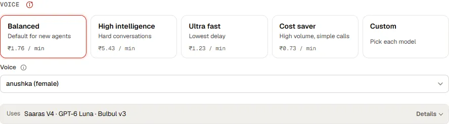
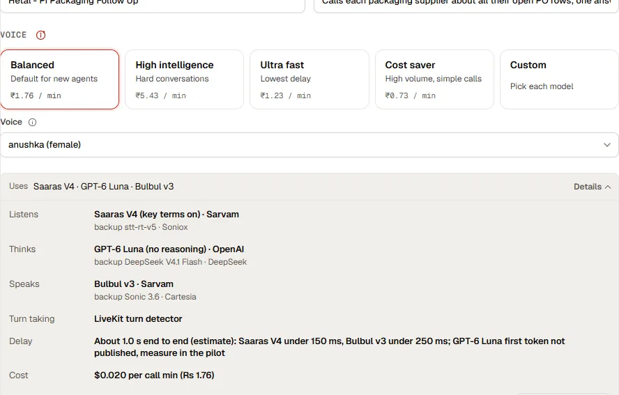

These settings sit on the agent’s **Voice** and **Settings** areas. Campaigns that use the agent inherit all of them.

## Voice

Pick a voice from the list. Each shows its gender. Leave it on **Default** to use the standard voice.

Voice changes apply as soon as you pick them, with no save needed, and do not disturb a prompt you are part-way through editing.

<Tip>
Test a new voice in the [call console](testing.md) with a real number before a campaign uses it. Names, numbers and local terms are where voices differ most.
</Tip>

## Voice presets <Badge tone="soon">Coming soon</Badge>

Pick one of four presets instead of choosing models. Each one names the model that listens, the model that thinks and the model that speaks, with a backup for each that takes over within 2.5 seconds if the main one fails.

| Preset | For | Listens | Thinks | Speaks | Turn taking | Price per call minute |
| --- | --- | --- | --- | --- | --- | --- |
| **Balanced** (default) | Most calls, natural Indian voice | Sarvam Saaras V4 | GPT-6 Luna | Sarvam Bulbul v3 | LiveKit turn detector | about Rs 1.76 ($0.020) |
| **High intelligence** | Disputes, negotiation, many orders on one call | Sarvam Saaras V4 | Claude Sonnet 5 | ElevenLabs Eleven v4 | LiveKit turn detector | about Rs 5.43 ($0.062) |
| **Ultra fast** | The lowest delay | ElevenLabs Scribe v2 Realtime | Mercury Voice | Murf Falcon 2 | Krisp Turn v3 | about Rs 1.23 ($0.014) |
| **Cost saver** | High volume, simple calls | Soniox | GPT-6 Luna | Murf Falcon 2 | The model's own | about Rs 0.73 ($0.008) |

Prices are model costs before telephony, from vendor price pages and public price listings (checked October 2026).

<Note>
Figures checked 5 October 2026. ElevenLabs Eleven v4 leads the Artificial Analysis voice arena; Bulbul v3 ranked first for listener preference on phone audio across 11 Indian languages in Sarvam's study; GPT-6 Luna scores 38 on the Artificial Analysis Intelligence Index; Mercury Voice answers in about 320 ms. Delays for each preset are being measured in pilot calls.
</Note>

Choose **Custom** to pick each model yourself. Conversation settings (who speaks first, how long a pause ends a turn, interruptions, small acknowledgements, noise filtering, voicemail, silence and length limits) are under **Advanced**.

## Language

The agent speaks the language its prompt tells it to use. Say it in a **language rules** section, for example “Speak Hinglish. Switch to English if the contact does.” Keep dates, amounts and codes in the form your contacts expect.

## Calling line

The calling line is the number and route the agent’s calls go out on. Your account team sets up lines for your workspace and links each agent to one.

<Warning>
Until an agent has a calling line, its campaigns cannot upload a list or place calls. The campaign form tells you when this is the case.
</Warning>

## Primary id column

Choose which input identifies a row in your own system, such as a PO number or order id. The agents list shows it, and results and exports carry it, so every outcome can be matched back to the record that produced it.
